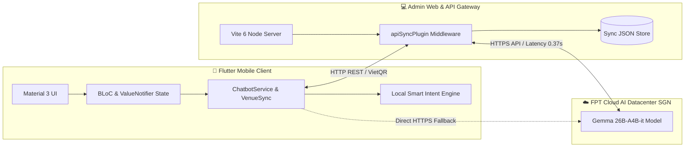

# 🏆 SportHub - Ứng Dụng Đặt Sân Thể Thao & Ghép Kèo AI

> **SportHub** là nền tảng quản lý, đặt sân thể thao thông minh (Cầu lông, Pickleball, Bóng đá) tích hợp **Trợ lý ảo AI Chatbot Đa Kênh** và thanh toán **VietQR 1 chạm** tại TP.HCM.  
> Đồ án môn học: **Lập trình trên thiết bị di động (Mobile App Development)**.

---

## 👥 THÔNG TIN NHÓM PHÁT TRIỂN & PHÂN CÔNG NHÁNH (TEAM CONTRIBUTIONS)

| STT | Họ và Tên | Vai trò chính | Nhánh Git phụ trách | Nhiệm vụ đảm nhiệm |
| :---: | :--- | :--- | :--- | :--- |
| **1** | **Lê Quốc Anh** *(Trưởng nhóm)* | AI Chatbot Core & Backend Gateway | `feature/chatbot-multi-agent` | • Kiến trúc Dual-Mode Hybrid AI (FPT Cloud Gemma 26B + Local Intent Engine).<br>• Bộ bóc tách ngôn ngữ tự nhiên, giờ khẩu ngữ, đa ý định và an toàn Guardrails.<br>• Viết API Sync Gateway (`apiSyncPlugin.ts`) và cấu hình quyền Android. |
| **2** | **Nguyễn Văn An** | Flutter UI/UX & Booking Flow | `feature/booking-vietqr-ui` | • Xây dựng giao diện ma trận sân `VisualCourtMatrix` và `VenueDetailScreen`.<br>• Thiết kế thẻ tương tác Native `ChatBookingCard`, tích hợp thư viện `qr_flutter`.<br>• Xử lý luồng chọn dịch vụ phụ (Add-ons) và lọc môn thể thao đa năng. |
| **3** | **Trần Minh Đức** | State Management & Partner Portal | `feature/owner-dashboard-sync` | • Quản lý trạng thái Reactive qua Event Bus `TicketStore` và `VenueSyncService`.<br>• Xây dựng phân hệ Chủ sân (`OwnerManagementTab`) tra cứu doanh thu và check-in.<br>• Phát triển Web Admin Portal (React 19 + TypeScript + Tailwind CSS). |

---

## 🚀 CÔNG NGHỆ CHÍNH ĐƯỢC SỬ DỤNG (TECH STACK)



### 1. Phía Mobile App (Flutter / Dart)
- **Framework:** Flutter SDK `>= 3.0.0` (Dart 3, Material 3 Design).
- **Quản lý trạng thái:** `ValueNotifier` (Reactive siêu nhẹ), Event Bus `TicketStore.onTicketAdded`, BLoC pattern.
- **Thanh toán & QR:** `qr_flutter` (^4.1.0) sinh mã VietQR động trực tiếp trên thẻ chat.
- **Mạng & Định dạng:** `http` (^1.6.0), `intl` (^0.19.0), `cached_network_image` (^3.4.1).
- **Kiểm thử tự động:** `flutter_test`, `bloc_test` (^9.1.7), `mocktail` (^1.0.4).

### 2. Phía Web Admin & Backend Sync Server
- **Frontend SPA:** React 19, TypeScript, React Router DOM 7, Tailwind CSS v4, Lucide React.
- **Build tool & Local Gateway:** Vite 6, Custom Plugin Middleware (`apiSyncPlugin.ts`).
- **Kiểm thử Web:** Vitest 3, Testing Library React (**81/81 tests pass**).

### 3. Phân Hệ Trí Tuệ Nhân Tạo (Chatbot Multi-Agent)
- **Kiến trúc Trí tuệ lai (Dual-Mode):** Ưu tiên gọi FPT Cloud AI (Gemma 26B); tự động chuyển sang Local Smart Intent Engine (viết bằng Dart) khi mất mạng.
- **4 Phân hệ Agent:**
  1. *Orchestrator & Safety Guard Agent:* Phân phối luồng, bảo mật phân quyền Role Isolation, chống ảo giác thời gian thực.
  2. *Smart Booking & Dynamic Slot Agent:* Bóc tách tiếng Việt không dấu, giờ khẩu ngữ (*"5 rưỡi chiều"*, *"7h kém 15"*), tính giá cao điểm.
  3. *Add-on & Live Transaction Sync Agent:* Thêm/bớt nước uống, thuê vợt, đồng bộ VietQR và hủy vé Idempotent.
  4. *Multimodal Matchmaking Vision Agent:* Phân tích hình ảnh poster và tự động đăng bài tìm người lên Bảng tin Cộng đồng.

---

## 🛠️ HƯỚNG DẪN CÀI ĐẶT & CHẠY DỰ ÁN (SETUP GUIDE)

### Bước 1: Clone mã nguồn từ GitHub
```bash
git clone https://github.com/EngLandLee/Laptrinhdidong.git
cd Laptrinhdidong
git checkout main
```

### Bước 2: Khởi chạy Web Admin & API Backend (Terminal 1)
```bash
cd admin-web
npm install
npm run dev
```
> Cổng điều phối Backend sẵn sàng tại: `http://localhost:5173`.

---

### Bước 3: Khởi chạy Ứng dụng Di động Flutter (Terminal 2)

#### 🌐 Cách 1: Chạy trên trình duyệt Chrome (Khuyến nghị demo)
```bash
flutter pub get
flutter run -d chrome
```

#### 📱 Cách 2: Chạy trực tiếp trên Điện thoại Android cắm cáp USB
1. Bật **Gỡ lỗi USB (USB Debugging)** trên điện thoại Android và cắm cáp vào máy tính.
2. Mở Terminal và chạy các lệnh:
```bash
# 1. Kiểm tra kết nối thiết bị
adb devices

# 2. Chuyển tiếp cổng kết nối backend (RẤT QUAN TRỌNG)
adb reverse tcp:5173 tcp:5173

# 3. Khởi chạy ứng dụng lên điện thoại
flutter run
```

---

## 🧪 KIỂM THỬ TỰ ĐỘNG (AUTOMATED TEST VERIFICATION)

Dự án đạt tỉ lệ kiểm thử thành công **100% (0 lỗi tồn đọng)**:

```bash
# 1. Chạy toàn bộ 80 bài kiểm thử Flutter (Chatbot & Screen)
flutter test test/core/services/ test/presentation/screens/ test/presentation/widgets/chat/
# Output: 00:12 +80: All tests passed!

# 2. Chạy toàn bộ 81 bài kiểm thử Web Admin & API Backend
cd admin-web && npm test -- --run
# Output: 14 passed (14), 81 passed (81)
```

---

## 📚 TÀI LIỆU BÁO CÁO & THUYẾT TRÌNH
- 📄 **[Báo Cáo Giữa Kỳ Tinh Gọn (Slide & Lời Thoại 5 Phút)](docs/CHATBOT_BAO_CAO_GIUA_KY.md)**
- 📄 **[Tài Liệu Kỹ Thuật Chuyên Sâu & Giải Quyết Xung Đột](docs/CHATBOT_TECHNICAL_DEFENSE_AND_ARCHITECTURE.md)**
- 📄 **[Hướng Dẫn Setup & Kịch Bản Demo](docs/CHATBOT_PRESENTATION_AND_SETUP.md)**
